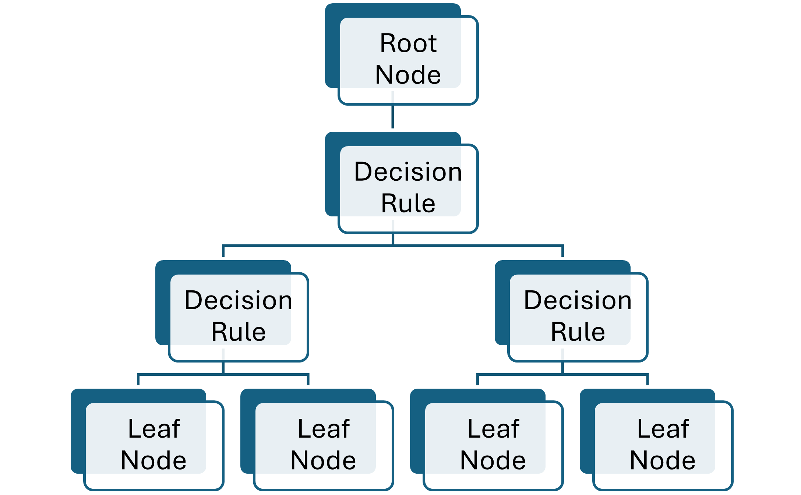
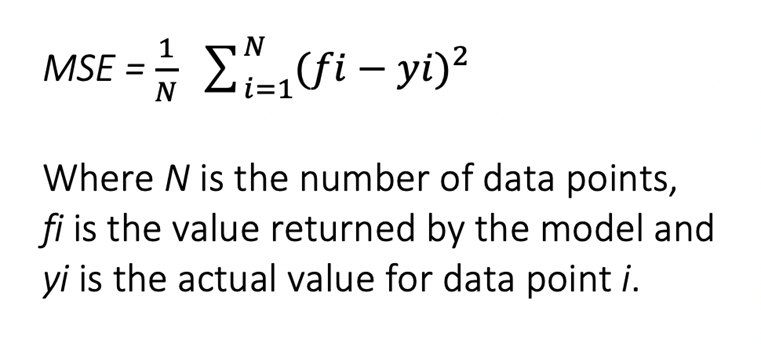

<!--

This is for me later, once the slides are ready to go.

Slides: [slides.html](slides.html){target="_blank"} ( Go to `slides.qmd`
to edit)
-->

## Introduction

Flooding is caused by many mechanisms, including when heavy rainfall causes rivers to overflow, when impervious surfaces reduce water infiltration, and/or when soil becomes oversaturated (@Javadinejad2022; @Lecce2000FloodTiming). Flash floods are considered to be one of the most severe natural disasters due to their rapid onset, unpredictability, infrastructure damage, and associated fatalities (@Diakakis2020; @Sadkou2024FlashFloods). Infrastructure and agricultural damage costs have steadily increased in the twentieth century (@Saharia2017). According to the IPCC, the severity and frequency of flood-causing severe storms will likely increase due to climate change (@IPCC2021Chapter11; @Halsnaes2023FloodModels). Due to Northwest Florida’s location relative to the Gulf of Mexico and major hurricane paths, most flooding research has focused on sea-level rise and coastal flooding, leaving inland flood risk understudied (@Bilskie2014Dynamics; @Morss2024Storm). Floods are extremely important to keep track of as they prove to contribute to human deaths, property damage, ecosystem changes, and social-economic losses (@Chen2020FloodSusceptibility). Growing evidence of machine learning models' capabilities to accurately predict storm severity and susceptibility highlights a major opportunity to apply these models to Northwest Florida (@Gensini2021SevereML; @Akshay2021FloodSeverity; @Chen2022RandomForestGeo).

Random Forest (RF) is a type of machine learning algorithm that predicts the dependent variable based on independent variables (@Salman2024RandomForest). RF is a smart model that uses simple models, aka decision trees (@Salman2024RandomForest). Errors produced by the random forest training can be counteracted by increasing the number of samples and trees of classification (@Wang2015FloodRF). Additionally, each decision tree’s selection of data is random, which prevents the model from memorizing the data (@Salman2024RandomForest). The RF application allowed for the importance of each variable to be assessed, and each index contribution to the overall risk was calculated pertaining to the relevant study of interest in China (@Wang2015FloodRF). The RF technique is optimal for performing hydrological studies due to the ability of the machine learning model to map flood risk analysis for hazard assessment with a low-cost application of the non-traditional model compared to rainfall-runoff models (@Zhu2022FloodRF). For instance,  a machine learning study in 2024 using 16 flood risk factors (FRFs), including historic flood damage locations, found that several high and very high flood risk areas closely overlapped with FEMA’s 100-year floodplain in Tampa Bay (@Dey2024). In another hydrological study, RF was able to reproduce the characteristics of the studied flood events and represented the daily flood discharge well in comparison with the hydromad modeling (@Schoppa2020RFDischarge). As research progresses, it is noted that identifying key driving factors and validating them via machine learning is a key driver in precision flood prediction (@Tan2024FlashFloodDrivers).

Northwest Florida, often referred to as the Florida Panhandle, is home to 16 counties: Escambia, Santa Rosa, Okaloosa, Walton, Holmes, Washington, Bay, Jackson, Calhoun, Gulf, Liberty, Franklin, Gadsden, Leon, Wakulla, and Jefferson. Since January 1996, these counties have had 1,052 floods, 790 of which were flash floods and 262 non-flash floods. Flooding has resulted in approximately $656 million in property damage throughout the counties, with Escambia County ranking number one in damage with approximately $152 million since 1996 (@NOAAStormEvents). This study will be utilizing RF to predict flood severity in Northwest Florida based on an index created using the number of injuries, number of deaths, time of flooding event, type of flood (flash and non-flash), and property damage. This type of RF modeling has not been used at a county level in Northwest Florida and most flooding research is focused on coastal flooding due to the counties being in major hurricane paths. This is important because floods are not uniform for every county and mitigation planning is an important part of preparing for natural hazards. 

## Data and Visualization

Data source: https://www.ncei.noaa.gov/stormevents/

In this section, our project focuses on the Random Forest Regression Analysis of flood severity predictability, utilizing the National Oceanic and Atmospheric Administration (NOAA) storm events data set. Variables in the NOAA storm events data set that will be used in this study are listed in Table 1. This data set can be split into 70/30 training and testing to evaluate the model’s accuracy. To do this we will create a severity index (Table 2) based off of the variables in table one for the 70% split that will be used for training. For the 30% split the raw data for the same variables will be used to check the accuracy of Random forest's ability to predict the flood severity index. The severity index, ranging 0 to 7, will be used as a continuous outcome variable in the regression model.


```{=html}
<style>
.figure-caption,
figcaption,
caption {
  font-size: 24px !important;
  font-weight: bold !important;
}
</style>
```

```{r}


# Creae vectors for each column of my table

library(gt)
library(tibble)
library(dbplyr)
library(knitr)


Variable <- c(
    "EVENT_TYPE",
    "BEGIN_DATE_TIME",
    "DAMAGE_PROPERTY",
    "INJURIES_DIRECT",
    "DEATHS_DIRECT"
  )
Definition <- c(
    "Type of severe weather event (e.g., Flood, Flash Flood).",
    "Date and time when the event began.",
    "Estimated property damage caused by the event in U.S. dollars.",
    "Number of direct injuries attributed to the event.",
    "Number of direct fatalities attributed to the event."
  )

# Combine vectors into a data frame

NOAA_Variables <- data.frame(Variable, Definition)

kable(NOAA_Variables, caption = "Table 1: NOAA Storm Events Data Dictionary (Variables Used)")
```
```{r}
Classifier <- c(
    "Flood",
    "Flash Flood",
    "Daylight",
    "Dusk and Dawn",
    "Nighttime",
    "No Deaths or Injuries",
    "Injuries (no deaths)",
    "Deaths",
    "Property and Crop Damage < $100,000",
    "Property and Crop Damage $100,000 - $500,000",
    "Property and Crop Damage > $500,000"
  )
Value <- c(
    "0",
    "1",
    "0",
    "1",
    "2",
    "0",
    "1",
    "2",
    "0",
    "1",
    "2"
  )

# Combine vectors into a data frame

NOAA_Class <- data.frame(Classifier, Value)

kable(NOAA_Class, caption = "Table 2: Flood Severity Index")

```
```{r}

library(dplyr)

stormall <- read_csv("StormEvents_NWFL.csv", show_col_types = FALSE)

flood_counts <- stormall %>%
  count(EVENT_TYPE)

flood_counts

flood_counts <- flood_counts %>%
  mutate(
    percent = n / sum(n) * 100
  )

library(ggplot2)

ggplot(flood_counts, aes(x = "", y = percent, fill = EVENT_TYPE)) +
  geom_col(width = 1, color = "white") +
  coord_polar(theta = "y") +
  geom_text(
    aes(label = paste0(round(percent,1), "%")),
    position = position_stack(vjust = 0.5),
    color = "white",
    size = 6
  ) +
  labs(
    title = "Flash Flood vs Flood Events",
    fill = "Event Type"
  ) +
  scale_fill_manual(values = c("Flash Flood" = "blue2", "Flood" = "chartreuse3")) +
  theme_void()
```
```{r}
library(dplyr)
library(ggplot2)
library(lubridate)

stormall %>%
  count(CZ_NAME_STR, EVENT_TYPE) %>%
  ggplot(aes(x = CZ_NAME_STR, y = n, fill = EVENT_TYPE)) +
  geom_col(position = "dodge") +
  scale_fill_manual(values = c("Flood" = "blue2", "Flash Flood" = "chartreuse3")) +
  labs(
    title = "Flood and Flash Flood Events by County",
    x = "County",
    y = "Number of Events",
    fill = "Event Type"
  ) +
  theme_minimal() +
  theme(
    axis.text.x = element_text(angle = 45, hjust = 1)
  )
```
<!-- Use this if we want to see damage for each county. They are small images though.
library(dplyr)
library(ggplot2)
library(lubridate)

damage_year <- storm %>%
  mutate(
    DAMAGE_PROPERTY_NUM = as.numeric(DAMAGE_PROPERTY_NUM),
    year = year(mdy(BEGIN_DATE))
  ) %>%
  group_by(CZ_NAME_STR, year) %>%
  summarise(
    total_damage = sum(DAMAGE_PROPERTY_NUM, na.rm = TRUE),
    .groups = "drop"
  )

counties <- unique(damage_year$CZ_NAME_STR)

for (cty in counties) {
  p <- damage_year %>%
    filter(CZ_NAME_STR == cty) %>%
    ggplot(aes(x = year, y = total_damage / 1000000)) +
    geom_line(color = "blue2", linewidth = 1) +
    geom_smooth(method = "lm", se = FALSE, color = "red", linewidth = 1) +
    labs(
      title = paste("Property Damage Trend:", cty),
      x = "Year",
      y = "Total Property Damage (Millions of $)"
    ) +
    theme_minimal(base_size = 16)
  
  print(p)
}
-->

```{r, fig.width=12, fig.height=7}
library(dplyr)
library(lubridate)

yearly_data <- stormall %>%
  mutate(
    year = year(mdy(BEGIN_DATE)),
    DAMAGE_PROPERTY_NUM = as.numeric(DAMAGE_PROPERTY_NUM)
  ) %>%
  group_by(year) %>%
  summarise(
    storms = n(),
    total_damage = sum(DAMAGE_PROPERTY_NUM, na.rm = TRUE) / 1000000,
    .groups = "drop"
  )

scale_factor <- max(yearly_data$storms) / max(yearly_data$total_damage)

library(dplyr)
library(lubridate)
library(ggplot2)

yearly_data <- stormall %>%
  mutate(
    year = year(mdy(BEGIN_DATE)),
    DAMAGE_PROPERTY_NUM = as.numeric(DAMAGE_PROPERTY_NUM)
  ) %>%
  group_by(year) %>%
  summarise(
    storms = n(),
    total_damage_millions = sum(DAMAGE_PROPERTY_NUM, na.rm = TRUE) / 1000000,
    .groups = "drop"
  )

scale_factor <- max(yearly_data$storms) / max(yearly_data$total_damage_millions)

ggplot(yearly_data, aes(x = year)) +
  geom_col(aes(y = storms, fill = "Flood Events"), alpha = 0.7) +
  
  geom_line(aes(y = total_damage_millions * scale_factor,
                color = "Total Damage"),
            linewidth = 1.2) +
  
  geom_smooth(aes(y = total_damage_millions * scale_factor,
                  color = "Damage Trendline"),
              method = "lm", formula = y ~ x,
              se = FALSE, linewidth = 1) +
  
  geom_smooth(aes(y = storms,
                  color = "Frequency Trendline"),
              method = "lm", formula = y ~ x,
              se = FALSE, linewidth = 1,
              linetype = "dashed") +
  
  scale_fill_manual(
    name = "Legend",
    values = c("Flood Events" = "blue3")
  ) +
  
  scale_color_manual(
    name = "Legend",
    values = c(
      "Total Damage" = "chartreuse3",
      "Damage Trendline" = "red",
      "Frequency Trendline" = "orange"
    )
  ) +
  
  scale_y_continuous(
    name = "Number of Flood Events",
    sec.axis = sec_axis(~ . / scale_factor,
                        name = "Total Property Damage (Millions of $)")
  ) +
  
  scale_x_continuous(
    breaks = seq(min(yearly_data$year), max(yearly_data$year), by = 5)
  ) +
  
  labs(
    title = "Flood Events and Property Damage Over Time",
    x = "Year"
  ) +
  
  theme_minimal(base_size = 14)

```
```{r}
stormall %>%
  group_by(EVENT_TYPE) %>%
  summarise(
    injuries = sum(INJURIES_DIRECT, na.rm = TRUE),
    deaths = sum(DEATHS_DIRECT, na.rm = TRUE)
  )
stormall %>%
  group_by(CZ_NAME_STR) %>%
  summarise(
    injuries = sum(INJURIES_DIRECT, na.rm = TRUE),
    deaths = sum(DEATHS_DIRECT, na.rm = TRUE)
  )
stormall %>%
  group_by(CZ_NAME_STR) %>%
  summarise(
    injuries = sum(INJURIES_DIRECT, na.rm = TRUE),
    deaths = sum(DEATHS_DIRECT, na.rm = TRUE)
  )
stormall %>%
  mutate(year = year(mdy(BEGIN_DATE))) %>%
  count(year, EVENT_TYPE)

library(dplyr)
library(ggplot2)

injury_death_data <- stormall %>%
  group_by(EVENT_TYPE) %>%
  summarise(
    Injuries = sum(INJURIES_DIRECT, na.rm = TRUE),
    Deaths = sum(DEATHS_DIRECT, na.rm = TRUE),
    .groups = "drop"
  )
library(tidyr)

injury_death_long <- injury_death_data %>%
  pivot_longer(
    cols = c(Injuries, Deaths),
    names_to = "Impact_Type",
    values_to = "Count"
  )
ggplot(injury_death_long, aes(x = EVENT_TYPE, y = Count, fill = Impact_Type)) +
  geom_col(position = "dodge") +
  scale_fill_manual(values = c("Injuries" = "blue3", "Deaths" = "chartreuse3")) +
  labs(
    title = "Injuries and Deaths by Flood Type",
    x = "Flood Type",
    y = "Number of People",
    fill = "Impact"
  ) +
  theme_minimal(base_size = 16)
```
<!--

Starting here, I'm going to just look at the last six years of data, starting from 01-01, or I guess, okay, starting from January 1st, 2020 and ending on December 31st, 2025. Period. The reason we are narrowing the search is because we're looking at property damage to see if random forests can correctly predict property damage and then also predict accurate flood type. Period. We originally started with data dating all the way back to 1996, January 1st. However, flood damage is not easily converted, or property damage isn't easily converted from 30 years ago to the actual amounts today. So instead of using data for the last 30 years to train random forests accurately predict property damage, we wanted to just use the last six years. In addition, there's a total of 1,048 total storms or flash floods and floods that were downloaded for the counties in northwest Florida. And out of those, 488 are in the last six years. So I wanted to show that a large percentage of the storms are occurring now. So the original data, I wanted to just show that the trend lines are going up. I can't only use the data for the last six years to show like the trends and why this is important, because if we just look at the last six years, it looks as if floods are decreasing, or like the frequency of floods are decreasing, but that's not true. And it's skewed because it's only six years. So I need to do a full background first, and now I'm moving into just the last six years, and that's what we're going to train random forests on.
-->

```{r}
library(dplyr)
library(ggplot2)
prec <- read_csv("Prec.csv", show_col_types = FALSE)
head(prec)

# Assuming PREC has columns like "county" and "precipitation"

# Group by county and sum precipitation
prec_by_county <- prec %>%
  group_by(County) %>%
  summarise(total_precip = sum(PRCP, na.rm = TRUE))

# Create a bar chart showing total precipitation by county
ggplot(prec_by_county, aes(x = reorder(County, -total_precip), y = total_precip)) +
  geom_col(fill = "blue3") +
  labs(
    title = "Total Precipitation by County (2020–2025)",
    x = "County",
    y = "Total Precipitation (units)"
  ) +
  theme_minimal() +
  theme(axis.text.x = element_text(angle = 45, hjust = 1))
```

## Methods

Random Forest is a supervised machine learning algorithm that introduces two sources of randomness during training. First, it uses bootstrap sampling of the training data, meaning data points are randomly selected with replacement so that the same data point may appear multiple times in a tree’s training sample, while others may not appear at all. Second, at each split within a tree, a random subset of predictor variables is considered when determining the best split. A tree continues to split until further splitting stops improving prediction or a preset depth limit is reached (@Dutta2023COVIDML).

In Random Forest a tree will start at a root node containing all sampled data points. Then it chooses a variable to split the data (i.e. flood versus flash flood) then splits all sampled data points by that criteria. The tree creates splits on either side of the original split and then reorganizes the data points based on that criteria, as seen in Figure 1 (@Rigatti2017RandomForest). The severity index score for each storm and the tree’s goal is to continue splitting and to determine what variables and what splits best determine the same severity index.

```{r, fig.cap="Figure 1: General Representation of a Decision Tree", echo=FALSE}

```
### *Formula*

Mean square error is used in random forest regression to determine the optimal splits during training and evaluate the model performance. The lower mean square error that is determined, the greater the model accuracy. The squared difference between actual and predicted values is squared (yᵢ − ŷᵢ)². 1 over the number of observations averages the total squared error. The E symbol represents the summation of the observed data points (@hodson2021mean).

{fig-align="left"}

### Assumptions

* Each tree makes its own decisions.
* Data points are chosen randomly to reduce mistakes.
* Sufficient data ensures the trees have unique patterns and variety.
* Combining the predictions from different trees leads to a more accurate final result.

### Advantages

* Easy to identify importance of features
* Multiple decision trees tend to cause little risk of overfitting (not too close to original training data)
* Very accurate due to multiple subgroups
* Less need for data management (pre-processing to perform random forest)

### Limitations

* Slower to acquire observations for best decision making
* Bound by the lowest and highest observations (no extrapolate)
* Difficult to interpret the decisions of ‘best features’ seen with trees

```{r}
install.packages(c("readr", "dplyr", "lubridate", "suncalc"))
library(readr)
library(dplyr)
library(lubridate)
library(suncalc)

storm <- read_csv("StormEvents_NWFL.csv", show_col_types = FALSE)

nrow(storm)
names(storm)
head(storm)
View(storm)

storm <- storm %>%
  mutate(
    BEGIN_TIME = sprintf("%04d", as.integer(BEGIN_TIME)),
    END_TIME   = sprintf("%04d", as.integer(END_TIME)),
    
    begin_date = mdy(BEGIN_DATE),
    end_date   = mdy(END_DATE),
    
    begin_datetime = begin_date +
      hours(as.integer(substr(BEGIN_TIME, 1, 2))) +
      minutes(as.integer(substr(BEGIN_TIME, 3, 4))),
    
    end_datetime = end_date +
      hours(as.integer(substr(END_TIME, 1, 2))) +
      minutes(as.integer(substr(END_TIME, 3, 4)))
  )

storm %>%
  select(CZ_NAME_STR, BEGIN_DATE, BEGIN_TIME, begin_datetime) %>%
  head(10)
```
```{r}
storm <- storm %>%
  mutate(
    BEGIN_TIME = ifelse(BEGIN_TIME == 0, NA, BEGIN_TIME),
    END_TIME   = ifelse(END_TIME == 0, NA, END_TIME)
  )

storm <- read_csv("StormEvents_NWFL.csv", show_col_types = FALSE)

storm <- storm %>%
  mutate(
    BEGIN_TIME = ifelse(BEGIN_TIME == 0, NA, BEGIN_TIME),
    END_TIME   = ifelse(END_TIME == 0, NA, END_TIME),
    BEGIN_TIME = ifelse(is.na(BEGIN_TIME), NA, sprintf("%04d", as.integer(BEGIN_TIME))),
    END_TIME   = ifelse(is.na(END_TIME), NA, sprintf("%04d", as.integer(END_TIME))),
    begin_date = mdy(BEGIN_DATE),
    end_date   = mdy(END_DATE),
    begin_datetime = if_else(
      is.na(BEGIN_TIME),
      as.POSIXct(NA),
      as.POSIXct(begin_date) +
        hours(as.integer(substr(BEGIN_TIME, 1, 2))) +
        minutes(as.integer(substr(BEGIN_TIME, 3, 4)))
    )
  )

county_lookup <- data.frame(
  CZ_NAME_STR = c(
    "Escambia County", "Santa Rosa County", "Okaloosa County", "Walton County",
    "Holmes County", "Washington County", "Bay County", "Jackson County",
    "Calhoun County", "Gulf County", "Franklin County", "Liberty County",
    "Gadsden County", "Leon County", "Wakulla County", "Jefferson County"
  ),
  lat = c(
    30.61, 30.67, 30.66, 30.62,
    30.85, 30.50, 30.18, 30.77,
    30.35, 29.85, 29.82, 30.22,
    30.58, 30.46, 30.15, 30.58
  ),
  lon = c(
    -87.34, -86.88, -86.58, -86.12,
    -85.71, -85.64, -85.68, -85.23,
    -85.19, -85.30, -84.88, -84.88,
    -84.62, -84.28, -84.37, -83.90
  )
)

storm <- storm %>%
  left_join(county_lookup, by = "CZ_NAME_STR")

sun_input <- storm %>%
  distinct(CZ_NAME_STR, begin_date, lat, lon) %>%
  filter(!is.na(begin_date), !is.na(lat), !is.na(lon)) %>%
  rename(date = begin_date)

sun_times <- getSunlightTimes(
  data = sun_input,
  keep = c("dawn", "sunrise", "sunset", "dusk"),
  tz = "America/Chicago"
)

storm2 <- storm %>%
  left_join(
    sun_times %>% rename(begin_date = date),
    by = c("begin_date", "lat", "lon")
  ) %>%
  mutate(
    light_period = case_when(
      is.na(begin_datetime) ~ "unknown",
      begin_datetime >= sunrise & begin_datetime < sunset ~ "daylight",
      (begin_datetime >= dawn & begin_datetime < sunrise) |
        (begin_datetime >= sunset & begin_datetime < dusk) ~ "dawn_dusk",
      TRUE ~ "night"
    )
  )
View(storm2)


library(dplyr)

# Step 1: Classify flood severity
storm2 <- storm2 %>%
  mutate(
    flood_severity = case_when(
      EVENT_TYPE == "Flash Flood" ~ 2,
      EVENT_TYPE == "Flood" ~ 1,
      TRUE ~ 0
    )
  )

# Step 2: Combine property and crop damage, then divide into terciles

storm2 <- storm2 %>%
  mutate(
    total_damage = DAMAGE_PROPERTY_NUM + DAMAGE_CROPS_NUM,
    damage_tercile = ntile(total_damage, 3) - 1  # ntile splits into thirds; subtract 1 to get 0/1/2
  )
max_damage <- max(storm2$total_damage, na.rm = TRUE)

cut1 <- max_damage / 3
cut2 <- 2 * max_damage / 3
storm2 <- storm2 %>%
  mutate(
    damage_tercile = case_when(
      total_damage <= cut1 ~ 0,
      total_damage > cut1 & total_damage <= cut2 ~ 1,
      total_damage > cut2 ~ 2
    )
  )

# Step 3: Classify time-of-day
storm2 <- storm2 %>%
  mutate(
    time_of_day_class = case_when(
      light_period == "daylight" ~ 0,
      light_period == "dawn_dusk" ~ 1,
      light_period == "night" ~ 2
    )
  )

# Step 4: Classify injury/death presence
storm2 <- storm2 %>%
  mutate(
    injury_death_class = case_when(
      DEATHS_DIRECT > 0 | DEATHS_INDIRECT > 0 ~ 2,
      INJURIES_DIRECT > 0 | INJURIES_INDIRECT > 0 ~ 1,
      TRUE ~ 0
    )
  )

storm2 <- storm2 %>%
  mutate(
    flood_severity = flood_severity + damage_tercile + time_of_day_class + injury_death_class
  )

head(storm2)
head(storm)
```
```{r}
library(randomForest)
library(dplyr)
library(tidyr)

storm <- storm %>%
  drop_na()

storm2 <- storm2 %>%
  drop_na()

storm <- storm %>%
  left_join(
    storm2 %>% select(EVENT_ID, flood_severity),
    by = "EVENT_ID"
  )

colSums(is.na(storm))
summary(storm$flood_severity)

library(lubridate)

storm <- storm %>%
  mutate(
    begin_date = mdy(BEGIN_DATE),
    year = year(begin_date),
    month = month(begin_date),
    day = day(begin_date)
  )
head(storm,10)

storm <- storm %>%
  mutate(flood_severity = flood_severity.x) %>%
  select(-flood_severity.x, -flood_severity.y)

rf_data <- storm %>%
  select(
    flood_severity,
    BEGIN_TIME,
    year,
    month,
    CZ_NAME_STR,
    EVENT_TYPE,
    DAMAGE_PROPERTY_NUM,
    DAMAGE_CROPS_NUM,
    INJURIES_DIRECT,
    DEATHS_DIRECT
  )


rf_data$CZ_NAME_STR <- as.factor(rf_data$CZ_NAME_STR)
rf_data$EVENT_TYPE  <- as.factor(rf_data$EVENT_TYPE)
rf_data$flood_severity    <- as.factor(rf_data$flood_severity)

colSums(is.na(rf_data))
```
```{r}
set.seed(42)

train_index <- sample(seq_len(nrow(rf_data)), size = 0.7 * nrow(rf_data))

train_data <- rf_data[train_index, ]
test_data  <- rf_data[-train_index, ]

rf_model <- randomForest(
  flood_severity ~ .,
  data = train_data,
  ntree = 500,
  importance = TRUE
)

print(rf_model)
varImpPlot(rf_model)
```
```{r}
rf_data2 <- storm %>%
  select(
    flood_severity,
    BEGIN_TIME,
    year,
    month,
    CZ_NAME_STR,
    EVENT_TYPE
  )

rf_data2$flood_severity <- as.factor(rf_data2$flood_severity)
rf_data2$CZ_NAME_STR <- as.factor(rf_data2$CZ_NAME_STR)
rf_data2$EVENT_TYPE <- as.factor(rf_data2$EVENT_TYPE)

set.seed(42)

train_index2 <- sample(seq_len(nrow(rf_data2)), size = 0.7 * nrow(rf_data2))

train_data2 <- rf_data2[train_index, ]
test_data2  <- rf_data2[-train_index, ]

rf_model2 <- randomForest(
  flood_severity ~ .,
  data = train_data2,
  ntree = 500,
  importance = TRUE
)

print(rf_model2)
varImpPlot(rf_model2)

table(storm$flood_severity)
```

